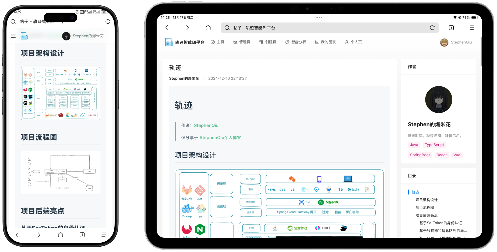
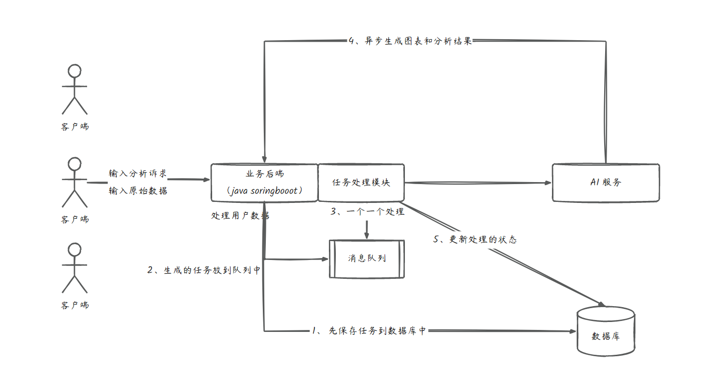
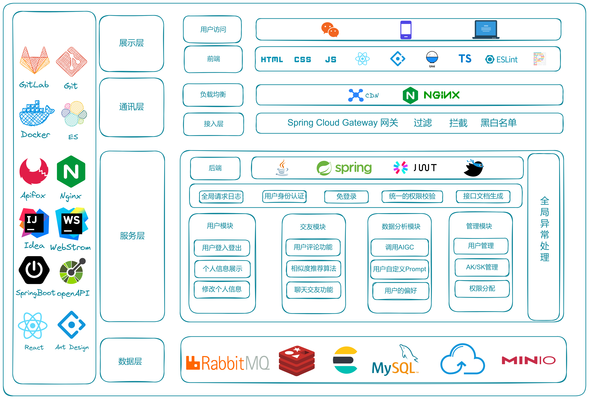
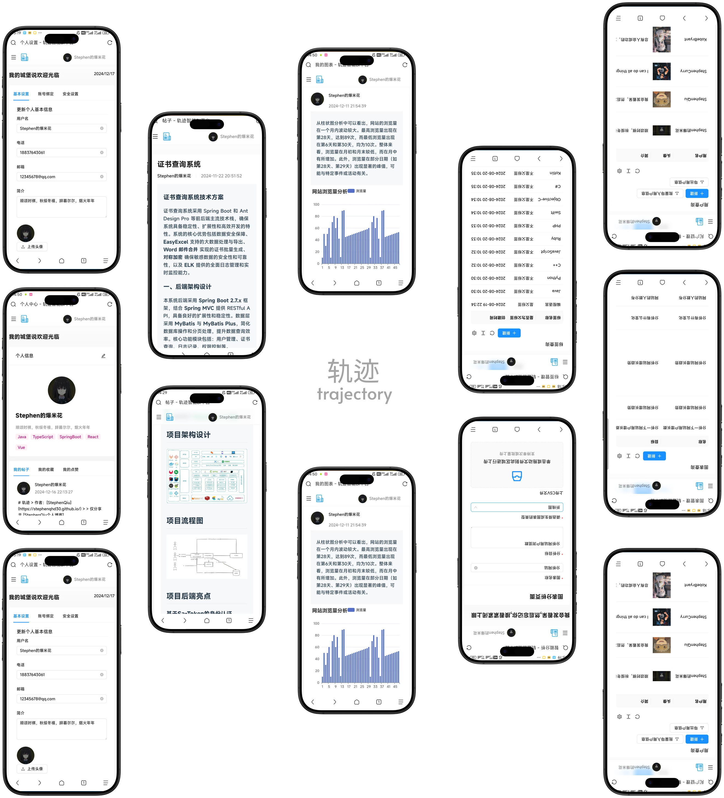

<div align="center">
  
  <h1>轨迹 (Trajectory)</h1>
  <p><b>智能 AIGC 数据可视化分析平台</b></p>
  <p><i>Empowering Data Insights with AI-Driven Visual Analytics</i></p>

  <p>
    
    
    
    
    
  </p>
</div>

---

## 📖 项目简介 (Project Overview)

**轨道 (Trajectory)** 是一款专为企业和个人设计的 **BI (商业智能) 平台**。不同于传统的手动配置图表，本项目深度集成 **AIGC (人工智能生成内容)** 技术，用户只需输入原始数据和分析目标，AI 即可自动识别数据特征、生成专业图表（ECharts/AntV）并给出深度分析结论。

Trajectory is a smart **Business Intelligence** platform that leverages AIGC to automate data visualization. Simply provide raw data and an objective, and the AI will handle the rest—from chart generation to insightful analysis.

---

## ✨ 核心特性 (Key Features)

- 🤖 **智能 AI 分析 (AI-Powered Analysis)**: 对接 OpenAI/中转接口，一键将原始 Excel 数据转化为可视化图表。
- 📊 **图表中心 (Chart Management)**: 支持图表的创建、编辑、查看、搜索及导出，提供流畅的数据资产治理。
- ⚡ **异步化处理 (Async & Scalable)**: 基于消息队列（RabbitMQ）和线程池，在大规模并发下依然保证系统响应。
- 📱 **多端适配 (Responsive Design)**: 完美支持 PC 与移动端，随时随地查看数据洞察。
- 🌐 **SEO 优化 (Performance & SEO)**: 基于 Next.js 服务端渲染 (SSR)，首屏加载极快，SEO 友好。
- 🔄 **实时同步 (Real-time Interaction)**: 集成 WebSocket 实现任务执行状态的实时推送与交互。

---

## 🛠️ 技术栈 (Tech Stack)

### 前端 (Frontend)
| 技术 | 说明 |
| :--- | :--- |
| **Next.js 15 (App Router)** | 后现代 React 框架，提供极佳的开发体验与 SSR 能力 |
| **Shadcn UI & Tailwind CSS** | 现代化的组件库与样式引擎，保证 UI 的一致性与高级感 |
| **ECharts** | 强大的可视化渲染引擎，支持复杂的交互图表 |
| **Framer Motion** | 流畅的微交互与动画效果 |
| **Redux Toolkit** | 高效的状态管理方案 |

### 后端 (Backend)
| 技术 | 说明 |
| :--- | :--- |
| **Spring Boot 3** | 高性能 Java 后端开发模板 |
| **Sa-Token** | 轻量级、功能强大的权限认证框架 |
| **RabbitMQ** | 异步任务处理与消息分发中心 |
| **MySQL + ShardingSphere** | 分库分表技术支持海量数据存储 |
| **Elasticsearch** | 支持多种设计模式优化的聚合搜索功能 |

---

## 🏗️ 项目架构 (Architecture)

### 核心流程 (Core Workflow)


### 系统架构图 (System Architecture)


---

## 🖼️ 预览 (Previews)

<div align="center">
  
  
  <br />
  
</div>

---

## 🚀 快速上手 (Quick Start)

### 1. 克隆项目 (Clone Repository)
```bash
git clone https://github.com/StephenQiu30/trajectory-next.git
cd trajectory-next
```

### 2. 安装依赖 (Install Dependencies)
```bash
pnpm install
```

### 3. 环境配置 (Configuration)
创建 `.env.local` 文件并填写相关后端接口地址。
```env
NEXT_PUBLIC_BASE_URL=http://localhost:8101
```

### 4. 启动项目 (Run Development)
```bash
npm run dev
# or
pnpm dev
```

---

## 👨‍💻 作者信息 (Author)

- **作者**: [StephenQiu](https://stephenqhd30.github.io/)
- **个人博客**: [StephenQiu's Blog](https://stephenqhd30.github.io/)
- **关注更多**: [GitHub](https://github.com/StephenQiu30)

---

## 📄 开源协议 (License)

本项目遵循 [MIT License](./LICENSE) (或默认开源协议)。

Copyright © 2024-Present [StephenQiu](https://github.com/StephenQiu30).
